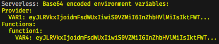

# serverless-base64-encode-env-vars

[](https://badge.fury.io/js/serverless-base64-encode-env-vars)

A serverless plugin to base64 encode environment variables that are objects.

The Serverless framework forces all environment variables defined in a serverless.yml to be strings. It can be useful to define environment variables as objects for better organization and a simplified top-level environment.

## Installation

npm install this package:
```
> npm install serverless-base64-encode-env-vars
```

Then, add `serverless-base64-encode-env-vars` to the plugins list in your serverless file:
```yaml
plugins:
  - serverless-base64-encode-env-vars
```

## Usage

This plugin is run when `serverless deploy` is executed. It searches for environment variables that are object types instead of strings and base64 encodes them before continuing on with the deploy process. The result of the encoding process is [printed to stdout](#example).

The encoded variables will need to be decoded within the codebase before they can be used as an object.

For example, decoding the value of an environment variable named `KEY1`:
```javascript
const decodedKey1 = Buffer.from(process.env.KEY1, 'base64').toString('utf8');
```

This plugin also adds the `encode` option to the `serverless` command. Running `serverless encode` will essentially perform a dry-run of the plugin functionality to demonstrate the result of encoding the specified variables.

By default all environment variables listed in the `provider` and `functions` sections that are object types are encoded. If you only want to encode some object variables you can specify these under `custom.encodeEnvObjects`:

```yaml
service: example

custom:
  encodeEnvObjects:
    - VAR1
    - VAR2
```
Here, `VAR1` and `VAR2` will be encoded but any other object variables will remain untouched.


## Example

```yaml
service: example

custom: 
  encodeEnvObjects:
    - VAR1
    - VAR4
  
plugins:
  - serverless-base64-encode-env-vars
  
provider:
  ...
  environment:
    VAR1:
      KEY1: value1
      KEY2: value2
      KEY3: value3
    VAR2: Normal string

functions:
  function1:
    handler: function1.main
    environment:
      VAR3: Just a string
      VAR4:
        KEY1: value1
        KEY2: value2
        KEY3: value3
      VAR5:
        KEY1: value1
    ...
```

Given the above example `serverless.yml` file, running `serverless encode` will print:



Notice that `VAR1` and `VAR4` have been encoded while `VAR5` has not. This is because only `VAR1` and `VAR4` are listed in the `custom.encodeEnvObjects` list.

## Other

This plugin is compatible with [serverless-offline](https://github.com/dherault/serverless-offline) and will encode variables before starting.

## License

MIT
